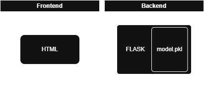

This repository was built with the help of ChatGPT to guide me through the steps of building an app with Docker and a machine learning model. Everything here is explained so I can use this as reference for future projects or in case I have any doubts. It's also a great way to exercise long-term memory 🙂

# Layout

my__first_model_app/
│
├── app.py
├── model.pkl
├── templates/
│   └── form.html
├── requirements.txt
├── Dockerfile
└── README.md

# How does it work?

## 1 Set up the local repository

Inside the app root folder, run

```
git init
```

Then create `.gitignore` to specify file extensions that will not be uploaded to github.

`git add .` to track all files in the root folder, this will make git track everything that changes in these files.

--- To commit changes, `git commit -m "commit message"` (can also just use the UI from VSCode)

### 2 Set up the remote repository

```
git remote add origin <repository link>
git branch -M main
git push -u origin main
```

### Flask—HTML interaction



At the frontend form.html grabs the inputs from the user with a PUSH, and Flask uses that input to get the prediction from the model.apk.
Then flask returns the results that are shown in the html with the help of JINJA2.