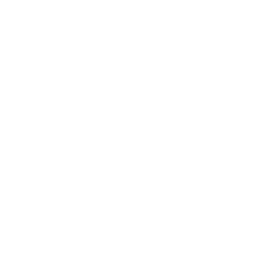

This repository was built with the help of ChatGPT to guide me through the steps of building an app with Docker and a machine learning model. Everything here is explained so I can use this as reference for future projects or in case I have any doubts. It's also a great way to exercise long-term memory 🙂

This app could have been easier built in `venv` but the purpose was to get a grasp of Docker.

# Layout



# How does it work?

## 1 Set up the local repository

Inside the app root folder, run

```
git init
```

Then create `.gitignore` to specify file extensions that will not be uploaded to github.

`git add .` to track all files in the root folder, this will make git track everything that changes in these files.

--- To commit changes, `git commit -m "commit message"` (can also just use the UI from VSCode)

### 2 Set up the remote repository

```
git remote add origin <repository link> # Adds a remote origin with the repository link provided
git branch -M main # renames the current LOCAL branch to main, -M forces the rename even if a main branch already exists
git push -u origin main # pushes the LOCAL main branch to the origin set up and the -u tells git to track the remote and local together
```
--- To push changes from here on now, `git push` (can also just use the UI from VSCode)

### Flask—HTML interaction


At the frontend form.html grabs the inputs from the user with a PUSH, and Flask uses that input to get the prediction from the model.apk.
Then flask returns the results that are shown in the html with the help of JINJA2.

Each file (html, app.py...) is very well commented for a more in-depth explanation of each line of code.

### Run the app

Inside the root folder, in the terminal, run:

```
docker build -t my-first-model-app . # this builds the docker image
docker run -p 5000:5000 my-first-model-app # this runs the docker container based on the image
```
WARNING: Docker doesn't auto-updates. It needs the image rebuilt everytime.

That's all. The app is running and working.